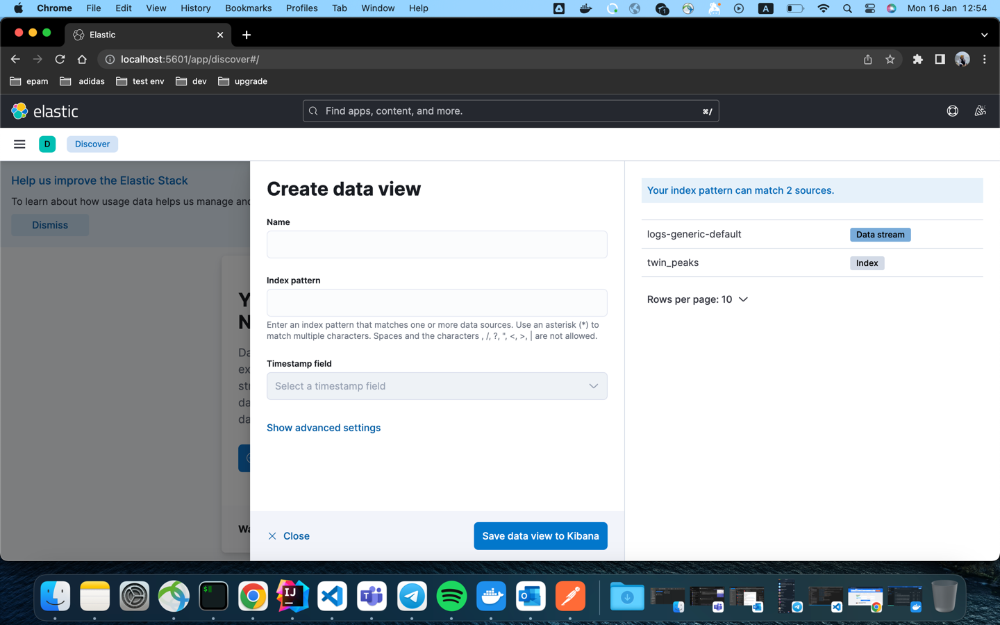

### Spring data elasticsearch application with ELK.
This app is producing Twin Peaks quotes to the Elasticsearch by rest endpoint.

> #### ELK strategy:
> - Filebeat:
>   - collect logs containers that have the label collect_logs_with_filebeat=true
>   - decode the message field to a JSON object when the label decode_log_event_to_json_object=true
>   - send the log events to Logstash which runs on the port 5044.
> - Logstash:
>   - receive events coming from Beats in the port 5044
>   - process the events by adding the tag logstash
>   - send the processed events to Elasticsearch which runs on the port 9200
> - Elasticsearch:
>   - stores and indexes the logs. It is a NoSQL database based on Lucene's open-source search engine.
> - Kibana:
>   - visualization layer on top of Elasticsearch
>   - search, view, and interpret the data stored in Elasticsearch.

---
#### Environment(environment folder):
- docker env can be found in `.env` and `docker-compose.yaml` files
- Filebeat is configured in `filebeat/filebeat.docker.yml`
- Logstash is configured in `logstash/logstash.conf`

---
> #### Important notes:
> - EFK(Elasticsearch + Fluentd + Kibana): https://docs.fluentd.org/v/0.12/container-deployment/docker-compose
> - Spring boot *tracing* via micrometer is added to the logs.
---
#### Test scenario:

 1. Build project:
    ```
    mvn clean package
    ```
 2. Run docker environment:
    ```
    docker compose up -d --build
    ```
 3. Send the quote to the elasticsearch:
    ```
    sh send.sh
    ```
 4. View logs from Logstash in the console log. \
    Example:
    ```
    logstash              | {
    logstash              |           "@timestamp" => 2023-01-16T07:12:48.958Z,
    logstash              |              "message" => "Started the application!",
    logstash              |                "level" => "INFO",
    logstash              |               "docker" => {
    logstash              |         "container" => {
    logstash              |             "labels" => {
    logstash              |                              "collect_logs_with_filebeat" => "true",
    logstash              |                              "com_docker_compose_version" => "2.13.0",
    logstash              |                              "com_docker_compose_project" => "environment",
    logstash              |                          "com_docker_compose_config-hash" => "990d2bd89fbffcc9a0323af980915fc171808461192fe39a35ba675f07ea0569",
    logstash              |                           "com_docker_compose_depends_on" => "elasticsearch:service_healthy",
    logstash              |                                "com_docker_compose_image" => "sha256:97284cfc80cd3363ce592a3cdaa95f49f0b1c3b1f400da6ec2e92ec025e48b95",
    logstash              |                               "com_docker_compose_oneoff" => "False",
    logstash              |                     "com_docker_compose_container-number" => "1",
    logstash              |                 "com_docker_compose_project_config_files" => "/Users/aqua-len/IdeaProjects/spring-elk/environment/docker-compose.yml",
    logstash              |                  "com_docker_compose_project_working_dir" => "/Users/aqua-len/IdeaProjects/spring-elk/environment",
    logstash              |                              "com_docker_compose_service" => "spring-elasticsearch",
    logstash              |                         "decode_log_event_to_json_object" => "true"
    logstash              |             }
    logstash              |         }
    logstash              |     },
    logstash              |                 "type" => "logs",
    logstash              |          "thread_name" => "main",
    logstash              |            "container" => {
    logstash              |            "id" => "da6c27aaeff3a11651ddde5bde781822676cc8fe71f2f10198a370c92d9f6299",
    logstash              |          "name" => "spring-elasticsearch",
    logstash              |         "image" => {
    logstash              |             "name" => "environment-spring-elasticsearch"
    logstash              |         }
    logstash              |     },
    logstash              |                 "host" => {
    logstash              |         "name" => "972c59be6d62"
    logstash              |     },
    logstash              |               "stream" => "stdout",
    logstash              |                "input" => {
    logstash              |         "type" => "container"
    logstash              |     },
    logstash              |             "@version" => "1",
    logstash              |     "application_name" => "spring-elasticsearch",
    logstash              |                  "log" => {
    logstash              |           "file" => {
    logstash              |             "path" => "/var/lib/docker/containers/da6c27aaeff3a11651ddde5bde781822676cc8fe71f2f10198a370c92d9f6299/da6c27aaeff3a11651ddde5bde781822676cc8fe71f2f10198a370c92d9f6299-json.log"
    logstash              |         },
    logstash              |         "offset" => 6815
    logstash              |     },
    logstash              |                "agent" => {
    logstash              |         "ephemeral_id" => "76e09cf1-0842-43ce-bcf8-419806510771",
    logstash              |                 "name" => "972c59be6d62",
    logstash              |                 "type" => "filebeat",
    logstash              |              "version" => "8.6.0",
    logstash              |                   "id" => "4a95f3f1-8690-4738-bd4f-bb0bd8270b62"
    logstash              |     },
    logstash              |                 "tags" => [
    logstash              |         [0] "beats_input_codec_plain_applied",
    logstash              |         [1] "logstash"
    logstash              |     ],
    logstash              |                  "ecs" => {
    logstash              |         "version" => "8.0.0"
    logstash              |     },
    logstash              |                "event" => {
    logstash              |         "original" => "Started the application!"
    logstash              |     },
    logstash              |          "logger_name" => "com.aqualen.springelk.SpringElkApplication"
    logstash              | }
    ```
 5. View all indexes in Kibana:
    http://localhost:5601/app/discover#/

---